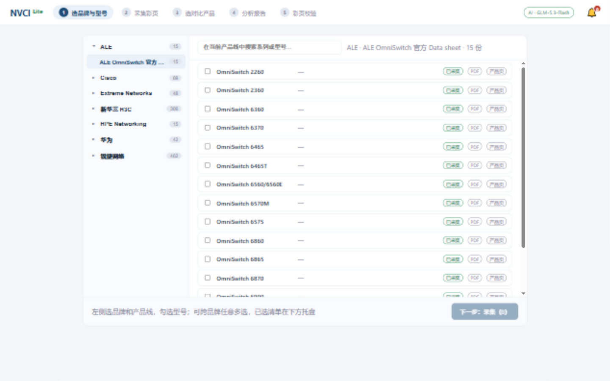
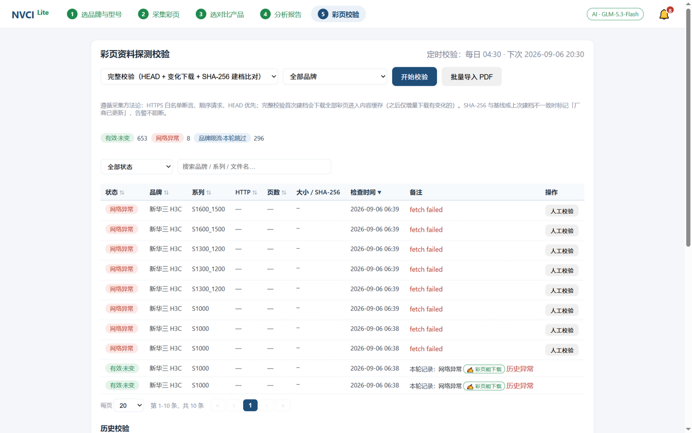
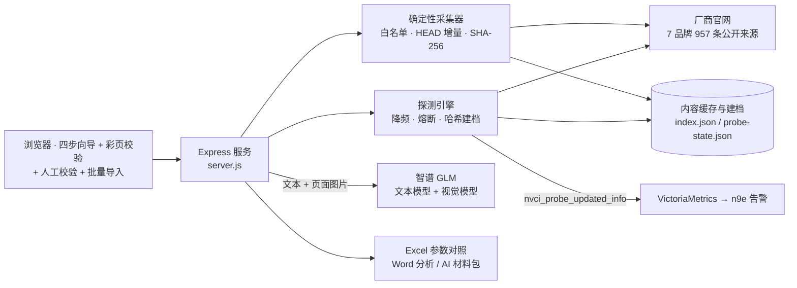

# NVCI Lite · 网络厂商彩页采集与对比分析

> 四步向导完成「选型号 → 采集 → 对比 → AI 报告」，第五步彩页校验用哈希建档守护 7 品牌 957 条官方来源的长期有效性，人工校验与批量导入兜底异常。





## 架构一图



**采集方法论（继承自 NVCI 完整版）**：仅访问已登记的公开官方 HTTPS 来源，域名白名单 + 受信重定向逐跳断言，HEAD 元数据增量比对，PDF 签名 + SHA-256 双校验，顺序请求、声明 UA、不绕过登录/验证码/访问控制。参数四态标注：**有值**（原文引用已核验）/ **待复核**（视觉或未过原文校验的机器推测值，须人工核对）/ **未披露**（不代表不支持）/ **抽取失败**。

NVCI 的轻量版：**选品牌产品线 → 一键采集彩页 → 跨品牌勾选对比 → AI 分析出报告**。
没有草稿审批链、没有治理门禁、没有审核队列，采集即用；但保留了原 NVCI 的合规采集底线。

## 快速开始（Windows / macOS / Linux，Node ≥ 20）

```bash
cd nvci-lite
npm install
npm start
```

浏览器打开 <http://localhost:8788>，按四步向导操作即可。

## 环境变量

| 变量 | 说明 | 默认 |
|---|---|---|
| `PORT` | 监听端口 | `8788` |
| `NVCI_LITE_DATA_DIR` | 数据目录（缓存/索引/导出） | `./data` |
| `NVCI_LITE_PASSWORD` | 访问口令（不设则本机免登录） | 空 |
| `NVCI_LITE_PROFILES_DIR` | 品牌目录来源 | 仓库自带 `./profiles`（旧版回退 `../NVCI/automation/bundled-profiles`） |
| `NVCI_LITE_AI_BASE` | AI 接口地址（见下方两种协议） | 空 |
| `NVCI_LITE_AI_KEY` | API Key | 空 |
| `NVCI_LITE_AI_MODEL` | 模型名 | `glm-4.6` |
| `NVCI_LITE_AI_PROTOCOL` | `openai`（`{base}/chat/completions`）或 `anthropic`（`{base}/v1/messages`） | `openai` |
| `NVCI_LITE_PROBE_ENABLED` | 定时彩页校验开关 | `false` |
| `NVCI_LITE_PROBE_SCHEDULE` | 定时校验触发时刻（每日，容器 TZ） | `04:30` |
| `NVCI_LITE_PROBE_MODE` | 定时校验模式：`full`（完整）或 `light`（轻量） | `full` |
| `NVCI_LITE_VM_URL` | Victoriametrics 地址（配置后「厂商已更新」自动推送指标，供 n9e 告警消费） | 空 |
| `NVCI_LITE_VISION` | 视觉兜底开关：`off`（默认）/ `auto`。默认关闭——图片抽取无文字层可校验，实测视觉模型会对无规格表的彩页编造参数，启用后结果仅作线索、需人工复核 | `off` |
| `NVCI_LITE_VISION_MODEL` | 视觉模型（弱文字彩页渲染页面图后抽参数） | `glm-4.6v` |
| `NVCI_LITE_VISION_DPI` / `NVCI_LITE_VISION_PAGES` | 页面渲染精度与页数上限 | `150` / `6` |

智谱 GLM 示例（Anthropic Messages 协议）：

```bash
set NVCI_LITE_AI_PROTOCOL=anthropic
set NVCI_LITE_AI_BASE=https://open.bigmodel.cn/api/anthropic
set NVCI_LITE_AI_KEY=你的Key
npm start
```

配置 AI 后自动生成 Word 分析报告；未配置则导出「AI 材料包」（单个 Markdown，含提示词 + 参数矩阵 + 彩页全文），整体复制给任意 AI 即可得到同结构分析。

## 输出物

- **Excel（参数对照）**：三个工作表——参数对照（行=参数分组，列=型号，三态标注）、资料清单（含官网链接与 SHA-256）、原文片段（取值 + 原文引用 + 页码）
- **Word（分析报告）**：执行摘要、硬门槛差异、逐参数分析、关键偏离、适用场景建议、采购验证问题清单
- **AI 材料包（无 Key 模式）**：单 Markdown

输出在 `data/exports/`，界面上直接下载。

## 彩页资料探测校验（第 5 步菜单）

对品牌库 957 条登记来源做周期性有效性验证，手动触发或定时自动运行（`NVCI_LITE_PROBE_ENABLED=true`）。方法论与采集完全一致：HTTPS 白名单断言、重定向逐跳校验、HEAD 元数据优先、顺序请求、声明 UA、不绕过访问控制。

- **完整校验**：HEAD 元数据比对 → 无变化直接复用缓存；有变化或未建档则下载 → PDF 签名检查 → SHA-256 建档比对（对 bundled 基线 `expectedSha256` 与上次建档哈希双重比对），判定「厂商已更新」时告警不阻断。首次全量建档会下载全部彩页进入内容缓存（约 1–3 GB，一次性），此后仅增量。
- **轻量探测**：仅 HEAD 元数据，不下载，适合快速巡检可达性。
- **状态分类**：有效·未变 / 新建档·与基线一致 / 厂商已更新 / 新建档（无基线）/ 资源不可用 / 跳转超出白名单 / 非 PDF 内容 / 文件无法解析 / 超出大小限制 / 网络异常。
- **建档存储**：`data/probe-state.json`，含每条资料最近状态、连续失败次数、SHA-256 与最近 10 次运行记录；界面可按状态筛选、查看历史。

## 采集方法论（继承自 NVCI）

- 仅访问 bundled-profiles 已登记的**公开官方 HTTPS 来源**（7 品牌 957 条），域名白名单 + 受信重定向逐跳断言
- HEAD 元数据比对增量采集：未变化直接复用本地缓存，不重复下载
- PDF 字节级检查（`%PDF-` 签名 / 页数）+ SHA-256 内容寻址缓存；与基线哈希不一致时标注 warning（厂商可能更新了彩页），不阻断
- 顺序请求、声明 UA、不绕过登录/验证码/访问控制
- 参数四态标注：有值（原文引用已核验）/ 待复核（视觉或未过原文校验的机器推测值，须人工核对）/ 未披露（不代表不支持）/ 抽取失败（看原文片段人工核对）
- 证据分级合并：规则抽取 > 已核验 AI 抽取 > 待复核；同键冲突时高等级胜出

## 目录结构

```
nvci-lite/
├── server.js          # 单文件 Express 服务
├── lib/
│   ├── catalog.js     # 品牌/产品线/型号目录（聚合 bundled-profiles）
│   ├── downloader.js  # 采集方法论（白名单/增量/校验/缓存）
│   ├── store.js       # 数据目录与索引
│   ├── pdf-text.js    # PDF 按页抽文本（pdfjs-dist）
│   ├── params.js      # 参数规则抽取 + 矩阵构建
│   ├── ai.js          # OpenAI 兼容接口调用
│   ├── report.js      # Excel / Word / 材料包生成
│   ├── page-markdown.js # 产品页静态抓取转 Markdown
│   └── probe.js         # 彩页探测校验引擎 + 哈希建档 + 定时调度
├── public/            # 四步向导 UI（无框架）
└── test/              # node:test
```

## 测试

```bash
npm test
```

## Docker（可选）

```bash
docker build -t nvci-lite .
docker run -d -p 8788:8788 -v /your/path/nvci-lite-data:/data nvci-lite
```

## 部署到 NAS（10.20.30.203）

部署配置在 `deploy.config.json`（含 SSH 与 AI Key，勿提交仓库），执行：

```bash
node deploy.js probe   # 探测远端环境（Docker/目录/端口）
node deploy.js push    # 打包上传 → docker compose 构建 → 健康检查
node deploy.js status  # 查看容器状态
node deploy.js logs    # 查看日志
```

当前部署：`http://10.20.30.203:8789`（8788 已被 sonic-pm-academy 占用）。资料目录已收编进仓库 `profiles/`（27 个产品线文件、957 条来源），Docker 内通过 `NVCI_LITE_PROFILES_DIR=/app/profiles` 挂载只读。

## 边界

- 产品页参数采集为静态抓取尽力而为：JS 动态渲染页只得到骨架时会明确标注，参数以 PDF 彩页为准
- 只管理公开资料；不会绕过登录、验证码、付费墙或厂商访问控制
